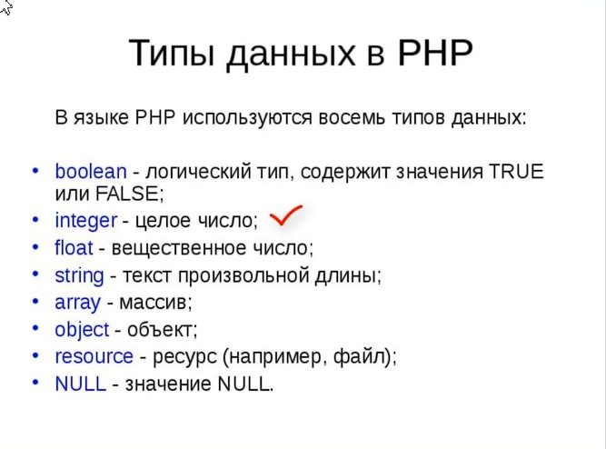

# PHP

## 01 Основы PHP

### Урок 1. Первый скрипт Hello World на PHP.

**PHP** - это (рекурсивный акроним словосочетания **PHP**: **Hypertext** **Preprocessor**) - это распространённый язык программирования общего назначения с открытым исходным кодом. **PHP** специально сконструирован для веб-разработок и его код может внедряться непосредственно в **HTML**.

Устанавливаем **Open server**, запускаем его. В папке с доменами создал репозиторий **PHP** а в нём папку **lesson1** с файлом **index.php**.    

**echo** — Выводит одну или более строк

### Урок 2. Конец строки.
Сокращённый вывод(исключительно одну строку).
```
<title><?= "Новая страница"; ?></title>
```

Текущая дата.
```
<?php
echo date(DATE_RSS); 
?>
```

Выражения.
```
     <?php
    echo 9
    -
    2
    +
    6;
     ?>  // 13
```
**mt_rand** — генерирует случайное значение с помощью генератора случайных чисел **Mersenne Twister**.
Рассмотрим функцию в помень с **HTML** кодом которая случайно после обновления страницы будит выводить то синий то красный.
```
    <?php
    if(mt_rand(0,1)){
        ?>
        <div style="color: blue">Синий</div>
        <?php
    } else {
        ?>
        <div style="color: red">Красный</div>
<?php    
}
    ?>
```

### Урок 3. Комментарии.

**//**       **/* */**       **#** - Коментарии.

### Урок 4. Подключение файла.

Разница между **include** и **require** заключается в том, что при подключении файла **PHP** первая инструкция позволяет продолжить выполнения скрипта, если не найден файл, а **require** завершает его, выводя фатальную ошибку.

_index_
```
<!DOCTYPE html>
<html lang="en">
<head>
    <meta charset="UTF-8">
    <meta http-equiv="X-UA-Compatible" content="IE=edge">
    <meta name="viewport" content="width=device-width, initial-scale=1.0">
    <title><?= "Новая страница"; ?></title>
</head>
<body>
<?php

echo 'glav<br>';
include 'second.php';
echo 'glav<br>'

?>
</body>
</html>
```
_second_
```
<?php
echo 'double<br>';
?>
<h2>new</h2>
```
### Урок 5. Переменные и типы данных.

Переменные в **PHP** представлены знаком доллара с последующим именем переменной. Имя переменной чувствительно к регистру.

Имена переменных соответствуют тем же правилам, что и остальные наименования в **PHP**. Правильное имя переменной должно начинаться с буквы или символа подчёркивания и состоять из букв, цифр и символов подчёркивания в любом количестве. Это можно отобразить регулярным выражением: **\^[a-zA-Z_\x80-\xff][a-zA-Z0-9_\x80-\xff]*$**



Пример.
```
<?php

$ara = 9;

echo $ara-8;
echo $ara-6;
echo $ara-5;
echo $ara-2;

?> ///1347
```

### Урок 6. Целые и вещественные числа.

Система счисления:        
**DEC** - Десятичная. 
**BIN** - Двоичная.
**HEX** - Шестнадцатеричная.
**OCT** - Восьмеричная.

```
<?php
$a = 1234; // десятичное число
$a = 0123; // восьмеричное число (эквивалентно 83 в десятичной системе)
$a = 0o123; // восьмеричное число (начиная с PHP 8.1.0)
$a = 0x1A; // шестнадцатеричное число (эквивалентно 26 в десятичной системе)
$a = 0b11111111; // двоичное число (эквивалентно 255 в десятичной системе)
$a = 1_234_567; // десятичное число (с PHP 7.4.0)
?>
```

### Урок 7. Логический и строковый тип данных.

Как и на **markdown** можно экранировать с помощью \.
```
$var = 5;
echo "Hello world! - \"$var";  //Hello world! - $var
```
C помощью фигурных скобок можно вывести переменную с числом.
```
$var = 5;
echo "Hello world! {$var}1";  //Hello world! 51
```

### Урок 8. Базовые функции языка PHP.

 **isset** — Определяет, была ли установлена переменная значением, отличным от **null**.       
 Пример:
 ```
<?php

$user;
if(isset($user))
    echo "Переменная существует";
else
    echo "Переменная не существует";  
    
?>
//Переменная не существует
 ```
 ```
<?php

$user="12";
if(isset($user))
    echo "Переменная существует";
else
    echo "Переменная не существует";  
    
?>
//Переменная существует
 ```

 **empty** — Проверяет, пуста ли переменная.         
 Пример:    
 ```
<?php

$str = "";
if(empty($srt))
    echo "Строка пустая";
    else
    echo "Чтот есть";

?>
// Строка пустая
 ```
  ```
<?php

$str = "abc";
if(empty($srt))
    echo "Строка пустая";
    else
    echo "Чтот есть";

?>
// Чтот есть
 ```

 **gettype** — Возвращает тип переменной.

 Пример:
 ```
<?php

echo gettype(12); // integer
echo gettype("12");// string
echo gettype(true);// boolean
echo gettype(1.2);// double

?>
 ```

 **is_int** — Проверяет, является ли переменная целым числом.

```
<?php

if(is_int(25))
    echo "число";
    else
    echo "не число";
?> 
 // число
```

### Урок 9. Явное и неявное приведение типов.

Пример:       
Попробуем из строки вычесть число.
```
<?php

$str = '45.2addf';
$number = $str - 12;
echo $number;
// 33.2
?>
```
Ещё пример:    
```
<?php

$str = '0.0';
if($str) {
    echo 'true';    
} else {
    echo 'false';
}
// false
?>
```
```
<?php

$str = '0.01';
if($str) {
    echo 'true';    
} else {
    echo 'false';
}
// true
?>
```
**false** преобразуеться в пустую строку, а **true** в единицу. 
```
<?php
    echo false
// 
?>
```
```
<?php
    echo true
// 1
?>
```


Примеры по картинке:
```
$float = 4.3;
$number = (int)$float;
echo $number;
// 4
```
Алгоритм для проверки чётное не чётное число.
```
<?php
  $num = 1347;
  $f = (float)($num/2) - (int)($num/2);
    if($f){
        echo 'нечет';
    } else {
        echo 'чёт';
    }
// нечёт
?>  
```

### Урок 10. Округление чисел.

**is_numeric** — определяет, является ли переменная числом или числовой строкой.     
Пример из документации:   
```
<?php
$tests = array(
    "42",
    1337,
    0x539,
    02471,
    0b10100111001,
    1337e0,
    "0x539",
    "02471",
    "0b10100111001",
    "1337e0",
    "not numeric",
    array(),
    9.1,
    null,
    '',
);

foreach ($tests as $element) {
    if (is_numeric($element)) {
        echo var_export($element, true) . " is число", PHP_EOL . "<br>";
    } else {
        echo var_export($element, true) . " is NOT число", PHP_EOL . "<br>" ;
    }
}
?>
//
```
```
'42' is число
1337 is число
1337 is число
1337 is число
1337 is число
1337.0 is число
'0x539' is NOT число
'02471' is число
'0b10100111001' is NOT число
'1337e0' is число
'not число' is NOT число
array ( ) is NOT число
9.1 is число
NULL is NOT число
'' is NOT число
```

**round** — округляет значение с плавающей точкой.

Пример.
```
<?php

echo round(1.34731234, 3 );

?>
```

**ceil** — Округляет дробь в большую сторону.
```
<?php
echo ceil(4.3);    // 5
echo ceil(9.999);  // 10
echo ceil(-3.14);  // -3
?>
```
**floor** — Округляет дробь в меньшую сторону.
```
<?php
echo floor(4.3);   // 4
echo floor(9.999); // 9
echo floor(-3.14); // -4
?>
```

**decbin** — Переводит число из десятичной системы счисления в двоичную.    
**bindec** - Двоичное в десятичное.       
**decoct** - Переводит число из десятичной системы счисления в восьмеричную.       
**dechex** - Переводит число из десятичной системы счисления в шестнадцатеричную.       
**base_convert** - Преобразование числа между произвольными системами счисления.    
**printf** - Выводит отформатированную строку, используя форматы %b, %032b или %064b.      
**sprintf** используя форматы %b, %032b или %064b.

---
* 1.1. Вывести на одной строке числа 31, 18 и  79 с  одним пробелом между ними.        
* 1.2. Вывести на экран числа 50 и  10 одно под другим.

1.1.
```
<?php

echo  "31"," ", "18"," " ,  "79";

?>
```
1.2.
```
<?php

echo  '50' , '<br>'; 
echo  "10";

?>
```

## 02 Основы ООП

### Урок 1. Классы и объекты.

**unset** — Удаляет переменную.

В новом файле **point.php** создал класс **Point** с переменными **x** и **y**,  подключил к индексу и вывел через **echo** два объекта. Потом через **unset** удалил второй объект.
_index_
```
<!DOCTYPE html>
<html lang="en">
<head>
    <meta charset="UTF-8">
    <meta http-equiv="X-UA-Compatible" content="IE=edge">
    <meta name="viewport" content="width=device-width, initial-scale=1.0">
    <title><?= "Новая страница"; ?></title>
</head>
<body>
<?php
    require 'point.php';

    $point1 = new Point();
    $point1->x = 13;
    $point1->y = 17;
    echo $point1->x , "<br>";

    $point2 = new Point();
    $point2->x = 12;
    $point2->y = 47;
    echo $point2->x , "<br>";

    unset($point2);
    echo $point2->x;
?>
</body>
</html>
```

_point_
```
<?php
class Point {
    public $x;
    public $y;
}

?>
```

### Урок 2. Области видимости переменных класса.

Свойства класса могут быть определены как **public**, **private** или **protected**. Свойства, объявленные без явного ключевого слова области видимости, определяются как общедоступные **(public)**.   

Объявление свойств и методов класса статическими позволяет обращаться к ним без создания экземпляра класса. К ним также можно получить доступ статически в созданном экземпляре объекта класса.
[Подробное описание](https://www.php.net/manual/ru/language.oop5.static.php)

Пример.
```
<?php

require 'point.php';

echo Point::$num;
 // 120
?>

<?php
class Point {
    public $x;
    public $y;
    public static $num = 120;
}

?>

```

Создадим переменную которая равна другой со значением, потом переопределим значение первой и выведем.
```
<?php

require 'point.php';

$first = $second = 2;
$first = 3
echo $first . '<br>' . $second;
// 3 значения разные.
   2 
?>
```
В объектах всё по другому **first** и **second** один и тот же объект.
```
<?php

require 'point.php';

$first = new Point;
$first->x=3;
$first->y=3;

$second = $first;
$second->x=5;
$second->y=5;

echo "{$second->x}, {$second->y}<br>";
echo "{$first->x}, {$first->y}";
?>// 5,5  
     5,5
```

Переменные можно делать ссылками с помощью **&**.
```
<?php

require 'point.php';

$first = 5;
$second = &$first;
$second = 3;
echo $first ,'<br>';
echo $second;
// 3
   3 
?>
```

### Урок 3. Расстояние между двумя точками.

Расмотрим ещё вариант клонирования объектов.
```
<?php

require 'point.php';

$first = new Point;
$first->x=3;
$first->y=3;

$second = clone $first;
$second->x=5;
$second->y=5;

echo "{$second->x}, {$second->y}<br>";
echo "{$first->x}, {$first->y}";
?>
// 5,5
   3,3 
```
**pow** — Возведение в степень.
Пример
```
<?php

var_dump(pow(2, 8)); // int(256)
echo pow(-1, 20); // 1
echo pow(0, 0); // 1
echo pow(10, -1); // 0.1

echo pow(-1, 5.5); // NAN
?>
```
**sqrt** — Квадратный корень.
```
<?php
// Точность зависит от ваших настроек точности
echo sqrt(9); // 3
echo sqrt(10); // 3.16227766 ...
?>
```
Решим это уравнение в php.      


```
<?php

require 'point.php';

$p1 = new Point;
$p1->x=10;
$p1->y=34;

$p2 = new Point;
$p2->x=3;
$p2->y=10;

$dis = sqrt((pow(($p2->x-$p1->x),2)+pow(($p2->y-$p1->y),2))); 

echo $dis;
// 25
?>
```

### Урок 4. Константы.

**define** — Определяет именованную константу. [Подробное описание](https://www.php.net/manual/ru/function.define.php).     
Пример
```
<?php
define("CONSTANT", "Hello world.");
echo CONSTANT; // выводит "Hello world."
echo Constant; // выводит "Constant" и выдаёт уведомление.

define("GREETING", "Hello you.", true);
echo GREETING; // выводит "Hello you."
echo Greeting; // выводит "Hello you."

// Начиная с PHP 7
define('ANIMALS', array(
    'собака',
    'кошка',
    'птица'
));
echo ANIMALS[1]; // выводит "кошка"

?>
```

**defined** — Проверяет существование указанной именованной константы.
```
<?php

if(define('NUMBER', 1)) {
    echo 'конста', '<br>';
}
if(defined('NUMBER')) {
    echo 'Уже есть такая';
}
//конста
  Уже есть такая
?>
```

**constant** — Возвращает значение константы.
```
<?php
$num = mt_rand(1,10);
$name = "VALUE($num)";
define($name, $num);
echo constant($name);
/// Рандомные числа от 1 до 10
?>
```
Стандартные константы([магические](https://www.php.net/manual/ru/language.constants.magic.php))
```
__LINE__	//Текущий номер строки в файле.
__FILE__	//Полный путь и имя текущего файла с развёрнутыми симлинками. Если используется внутри подключаемого файла, то возвращается имя данного файла.
__DIR__	 //Директория файла. Если используется внутри подключаемого файла, то возвращается директория этого файла. Это эквивалентно вызову dirname(__FILE__). Возвращаемое имя директории не оканчивается на слеш, за исключением корневой директории.
__FUNCTION__	//Имя функции или {closure} в случае анонимной функции.
__CLASS__	//Имя класса. Это имя содержит название пространства имён, в котором класс был объявлен (например, Foo\Bar). При использовании в методах трейтов 
__CLASS__ //является именем класса, в котором эти методы используется.
__TRAIT__	//Имя трейта. Это имя содержит название пространства имён, в котором трейт был объявлен (например, Foo\Bar).
__METHOD__	//Имя метода класса.
__NAMESPACE__	//Имя текущего пространства имён.
ClassNam=e::class	//Полное имя класса.
```
Пример
```
<?php
echo 'Имя файла ' . __FILE__ . '<br>'; Имя файла C:\OpenServer\domains\PHP\lesson14\index.php
echo 'Строка ' . __LINE__ . '<br>'; Строка 12
?>
```

### Урок 5. Путь к файлу, константы класса.

 Выражение **require_once** аналогично **require** за исключением того, что PHP проверит, включался ли уже данный файл, и если да, не будет включать его ещё раз.

 Относительный путь включает в себя полный адрес файла от корня диска
Абсолютные и относительные пути. При подключении файла в качестве его адреса можно указывать абсолютный или относительный путь. Абсолютный путь включает в себя полный адрес файла от корня диска. Пример: /var/www/web/site/inc/sub.php. Относительный путь содержит адрес только относительно текущей рабочей директории. Так если сценарий лежит в папке /var/www/web/site, то для подключения файла можно использовать такой путь: inc/sub.php.

Через \__DIR__ прописываем путь к файлу.
```
<?php

echo 'Путь к файлу ' . __DIR__ . '<br>';
require_once __DIR__ . '/../lesson13/point.php';

$p1 = new Point;
$p1->x=10;
$p1->y=34;

$p2 = new Point;
$p2->x=3;
$p2->y=10;

$dis = sqrt((pow(($p2->x-$p1->x),2)+pow(($p2->y-$p1->y),2))); 

echo $dis;

?>
```

Константы также могут быть объявлены в пределах одного класса. Область видимости констант по умолчанию **public**.
Пример
```
<?php
class MyClass
{
    const CONSTANT = 'значение константы';

    function showConstant() {
        echo  self::CONSTANT . "\n";
    }
}

echo MyClass::CONSTANT . "\n";

$classname = "MyClass";
echo $classname::CONSTANT . "\n";

$class = new MyClass();
$class->showConstant();

echo $class::CONSTANT."\n";
?>
```

Более простой пример
```
<?php

class cc {
    const NAME = "str";
}
if(defined('cc::NAME')) {
    echo "Константа определена";
}
// Константа определена
?>
```
Через константу выводим именно **::**, так работать не будет **cc->NAME**.

Запишем константу в нижнем регистре, и **else** при варианте **false**.
```
<?php

class cc {
    const NAME = "str";
}
if(defined('cc::name')) {
    echo "Константа определена";
} else {
   echo 'Константа не определена';
}
// Константа не определена
?>
```

## 03 Операции и операторы

### Урок 1. Конкатенация строк.

Конкатенация - это склеивание нескольких значений в одну строку.

В PHP есть два оператора для работы со строками (**string**). Первый - оператор конкатенации ('**.**'), который возвращает строку, представляющую собой соединение левого и правого аргумента. Второй - оператор присваивания с конкатенацией ('**.=**'), который присоединяет правый аргумент к левому. Для получения более полной информации ознакомьтесь с разделом Операторы присваивания.

Пример:
```
<?php
 $num = 7;
 $num .= '+5';
 echo 'lorem ' . $num , ' lorem';
 // lorem 7+5 lorem
?>
```

### Урок 2. Арифметические операторы.
```
Пример   	Эквивалент	    Операция
$a += $b	$a = $a + $b	Сложение
$a -= $b	$a = $a - $b	Вычитание
$a *= $b	$a = $a * $b	Умножение
$a /= $b	$a = $a / $b	Деление
$a %= $b	$a = $a % $b	Модуль
$a **= $b	$a = $a ** $b	Возведение в степень
```
Оператор – это элемент программного кода, который используется для выполнения определенного действия в выражении.

Примерами выражений с использованием операторов могут служить **$a+$b**, **$a=$b**, **$a!=$b**, **$a*=3**, **++$b**, **$a||$b** и др. Здесь символы и комбинации символов **+**, **=**, **!=**, **\**=**, **++**, **||** являются операторами, а выражения или значения, расположенные по сторонам операторов, называют операндами. [Подробное описание и полный список.](https://okmysite.com/php/php_uchebnik/vyrazhenija_i_operatory_v_php.html)


* ++ - инкремент 
* -- - декремент
Префиксный и постфиксный тип. На самом деле операции инкремента и декремента можно записывать двумя способами. В постфиксном виде операция записывается после имени переменной, вот так: **$a++**, а в префиксном виде - перед именем переменной, вот так: **++$a**.

### Урок 3. Поразрядные операторы.
 Таблица истиности.


Пример:
```
 <?php
 echo 6 & 10;
 // 2 
 ?>
```
Решение.


Ещё пример:
```
 <?php
 echo ~45;
 // -46
 ?>
```
Решение.


**$a << $b** — Сдвиг влево (все биты в **$a** смещаются влево на количество позиций в **$b**)
**$a >> $b** — Сдвиг вправо (все биты в **$a** смещаются вправо на количество позиций в **$b**)

[Подробное описание](https://habr.com/ru/post/134557/).

### Урок 4. Операторы сравнения.

[Приоритет оператора](https://www.php.net/manual/ru/language.operators.precedence.php)

### Урок 5. Условный оператор if.

[Подробная информация](https://www.php.net/manual/ru/control-structures.if.php)

Примеры:
```
<?php
if ($a > $b)
  echo "a больше b";
?>

<?php
if ($a > $b) {
  echo "a больше, чем b";
} else {
  echo "a НЕ больше, чем b";
}
?>

<?php
if ($a > $b) {
    echo "a больше, чем b";
} elseif ($a == $b) {
    echo "a равен b";
} else {
    echo "a меньше, чем b";
}
?>
```

Может быть несколько elseif в одном выражении if. Первое выражение elseif (если оно есть) равное true будет выполнено. В PHP вы также можете написать 'else if' (в два слова), и тогда поведение будет идентичным 'elseif' (в одно слово). Синтаксически значение немного отличается (если вы знакомы с языком С, это то же самое поведение), но в конечном итоге оба выражения приведут к одному и тому же результату.

Пример с переменной из курса, вывод с помощью **echo**.
```
<?php

$char = 'php';
if ($char == 'php') {
    echo "php";
} elseif ($char == 'js') {
    echo "js";
} elseif ($char == 'c#') {
    echo "c#";
}
else {
    echo "no";
}
//php
?>
```
Пример из курса, вывод с помощью **HTML** тега **h1**.
```
<?php

$char = 'c#';
if ($char == 'php') {
    ?>
    <h1>Язык пхп</h1>

    <?php
} elseif ($char == 'js') {
?>
<h1>js</h1>
<?php
} elseif ($char == 'c#') {
    ?>
    <h1>c#</h1>
<?php
} else {
    ?>
    <h1>no</h1>
<?php
}
//c#
?>
```


### Урок 6. Логические операторы.


Примеры по таблице:

```
<?php

// --------------------
// foo() никогда не будет вызвана, т.к. эти операторы являются шунтирующими (short-circuit)

$a = (false && foo());
$b = (true  || foo());
$c = (false and foo());
$d = (true  or  foo());

// --------------------
// "||" имеет больший приоритет, чем "or"

// Результат выражения (false || true) присваивается переменной $e
// Действует как: ($e = (false || true))
$e = false || true;

// Константа false присваивается $f, а затем значение true игнорируется
// Действует как: (($f = false) or true)
$f = false or true;

var_dump($e, $f);

// --------------------
// "&&" имеет больший приоритет, чем "and"

// Результат выражения (true && false) присваивается переменной $g
// Действует как: ($g = (true && false))
$g = true && false;

// Константа true присваивается $h, а затем значение false игнорируется
// Действует как: (($h = true) and false)
$h = true and false;

var_dump($g, $h);

//bool(true)
//bool(false)
//bool(false)
//bool(true)
?>
```

### Урок 7. Тернарный условный оператор, __, goto.

Тернарный оператор: Тернарный оператор (?:) - это условный оператор, используемый для выполнения простого сравнения или проверки условия, имеющего простые операторы. Это уменьшает длину кода, выполняющего условные операции. Порядок работы этого оператора-слева направо.

Пример:
Сначала проверяеться условие **$x < 0**, в зависимости от условия выбераеть **true(-$x)** или **false($x)** , потом записываеться в переменную с помощью присвоения **$x =**, вывод **echo**.
```
<?php

$x = -250;
$x = $x < 0 ? -$x : $x;
echo $x;
//250
?>
```

* Оператор объединения с null.    
Был добавлен оператор объединения с **null** **(??)**, являющийся синтаксическим сахаром для достаточно распространённого действия, когда совместно используются тернарный оператор и функция **isset()**. Он возвращает первый операнд, если он задан и не равен **null**, а в обратном случае возвращает второй операнд.
```
<?php
$y = 5;
$y = $y ?? 1;
echo $y;
//5
?>
```
```
<?php
$y = null;
$y = $y ?? 1;
echo $y;
//1
?>
```
Оператор **goto** используется для перехода в другую часть программы. Место, куда необходимо перейти указывается с помощью чувствительный к регистру метки, за которой ставится двоеточие, после оператора **goto** указывается желаемая метка для перехода. Оператор не является неограниченным **"goto"**. Целевая метка должна находиться в том же файле, в том же контексте. Имеется в виду, что вы не можете ни перейти за границы функции или метода, ни перейти внутрь одной из них. Вы также не можете перейти внутрь любой циклической структуры или оператора **switch**. Но вы можете выйти из них, и обычным применением оператора **goto** является использование его вместо многоуровневых **break**.
```
<?php
goto a;
echo 'Foo';

a:
echo 'Bar';
//Bar
?>
```
### Урок 8. Переключатель switch.

Оператор **switch** похож на ряд операторов **IF** с одинаковым условием. Во многих случаях вам может понадобиться сравнивать одну и ту же переменную (или выражение) с множеством различных значений и выполнять различные участки кода в зависимости от того, какое значение принимает эта переменная (или выражение). Это именно тот случай, для которого удобен оператор **switch**.

Переписываем код из 5-го урока, через **switch**.

```
<?php

$char = 'c#';
if ($char == 'php') {
    ?>
    <h1>Язык пхп</h1>

    <?php
} elseif ($char == 'js') {
?>
<h1>js</h1>
<?php
} elseif ($char == 'c#') {
    ?>
    <h1>c#</h1>
<?php
} else {
    ?>
    <h1>no</h1>
<?php
}
//c#
?>
```
_Switch_

```
<?php

$char = 'c++';
switch($char){
    case 'php':
        ?>
        <h1>Язык пхп</h1>
        <?php
        break;
    case 'js';
        ?>
        <h1>js</h1>
        <?php
        break;
    case 'c#';
        ?>
        <h1>c#</h1>
        <?php
        break;
    default:
        ?>
        <h1>no</h1>
<?php
}
?>
```
Перепишим ещё один код на мотив **switch**.

```
<?php
$n = 120;
if ($n > 0 && $n <=10) {
    echo "$n m 10 and b 0";
} elseif ($n > 10 && $n <=100) {
    echo "$n m 100 and b 10";
} elseif ($n > 100 && $n <=1000) {
    echo "$n m 1000 and b 100";
} else{
    echo "$n b 1000 or m 0";
}
// 120 m 1000 and b 100
?>
```
_Switch_

```
<?php
$n = 90;
switch(true) {
    case ($n > 0 && $n <= 10):
        echo "$n m 10 and b 0";
        break;
        case ($n > 10 && $n <= 100):
            echo "$n m 100 and b 10";
            break;
            case ($n > 0 && $n <= 10):
                echo "$n m 1000 and b 100";
                break;
                default: 
                    echo "$n b 1000 or m 0";
                    break;                          
}
?>
```

### Урок 9. Чтение из файла и запись в файл.

file_get_contents — Читает содержимое файла в строку.[подробно...](https://www.php.net/manual/ru/function.file-get-contents.php)
```
<?php

$homepage = file_get_contents('text.txt');
echo $homepage;
// (написанное в text.txt)
?>
```

file_put_contents — Пишет данные в файл.[подробно...](https://www.php.net/manual/ru/function.file-put-contents.php)
```
<?php

$homepage = file_get_contents('text.txt');
$homepage .= "\nЕщё одна строчка";
file_put_contents('textNew.txt',$homepage);
?>
```
Создадим файл с названием текущей даты.
```
<?php

$homepage = file_get_contents('text.txt');
$homepage .= "\nЕщё одна строчка";
$date = date("Y-m-d");
file_put_contents($date.'.txt',$homepage);
?>
```

### Урок 10. Цикл while.

Смысл выражения **while** очень прост. Оно указывает **PHP** выполнять вложенные выражения повторно до тех пор, пока выражение в самом **while** является **true**. Значение выражения **expr** проверяется каждый раз перед началом цикла, поэтому даже если значение выражения изменится в процессе выполнения вложенных выражений в цикле, выполнение не прекратится до конца итерации (каждый раз, когда **PHP** выполняет выражения в цикле - это одна итерация). Если выражение **while** равно **false** с самого начала, вложенные выражения ни разу не будут выполнены.
```
<?php
/* пример 1 */

$i = 1;
while ($i <= 10) {
    echo $i++ , "<br>";  /* выводиться будет значение переменной
                   $i перед её увеличением
                   (post-increment) */
}
//
1
2
3
4
5
6
7
8
9
10
/* пример 2 */

$i = 1;
while ($i <= 10):
    echo $i;
    $i++;
endwhile;
//12345678910
?>
```

**continue** - используется внутри циклических структур для пропуска оставшейся части текущей итерации цикла и, при соблюдении условий, начала следующей итерации.

```
<?php

$i = 0;
while($i <= 5) {
    $i++;
    if($i < 4) continue;
    if($i > 5) break;
    echo "$i<br>";
}
//4
5
?>

```

**break** - прерывает выполнение текущей структуры **for**, **foreach**, **while**, **do-while** или **switch**.

### Урок 11. Цикл do while.

Цикл **do-while** очень похож на цикл **while**, с тем отличием, что истинность выражения проверяется в конце итерации, а не в начале. Главное отличие от обычного цикла **while** в том, что первая итерация цикла **do-while** гарантированно выполнится (истинность выражения проверяется в конце итерации), тогда как она может не выполниться в обычном цикле **while** (истинность выражения которого проверяется в начале выполнения каждой итерации, и если изначально имеет значение **false**, то выполнение цикла будет прервано сразу).

```
<?php
$i = 0;
do {
    echo "$i<br>";
} while (++$i <= 5);
//0
1
2
3
4
5
?>
```

### Урок 12. Цикл for.

Цикл for самый сложный цикл в PHP. Он ведёт себя так же, как и в языке C. Синтаксис цикла for следующий:
```
for (expr1; expr2; expr3)
    statement
```

Примеры:
```
<?php
/* пример 1 */

for ($i = 1; $i <= 10; $i++) {
    echo "пример 1 ($i)<br>";
}

/* пример 2 */

for ($i = 1; ; $i++) {
    if ($i > 10) {
        break;
    }
    echo "пример 2 ($i)<br>";
}

/* пример 3 */

$i = 1;
for (; ; ) {
    if ($i > 10) {
        break;
    }
    echo "пример 3 ($i)<br>";
    $i++;
}

/* пример 4 */

for ($i = 1, $j = 0; $i <= 10; $j += $i, print "пример 4 ($i)", $i++);
?>
```

```
пример 1 (1)
пример 1 (2)
пример 1 (3)
пример 1 (4)
пример 1 (5)
пример 1 (6)
пример 1 (7)
пример 1 (8)
пример 1 (9)
пример 1 (10)
пример 2 (1)
пример 2 (2)
пример 2 (3)
пример 2 (4)
пример 2 (5)
пример 2 (6)
пример 2 (7)
пример 2 (8)
пример 2 (9)
пример 2 (10)
пример 3 (1)
пример 3 (2)
пример 3 (3)
пример 3 (4)
пример 3 (5)
пример 3 (6)
пример 3 (7)
пример 3 (8)
пример 3 (9)
пример 3 (10)
пример 4 (1)пример 4 (2)пример 4 (3)пример 4 (4)пример 4 (5)пример 4 (6)пример 4 (7)пример 4 (8)пример 4 (9)пример 4 (10)
```
---
### Задания по курсам.
```
3.1.	 Составить программу вычисления значения функции y = 17x^2 – 6x + 13 при любом значении x;
3.2.	 Даны два целых числа. Найти:
а) их среднее арифметическое;
б) их среднее геометрическое.
3.3.	 Известны объем и масса тела. Определить плотность материала этого тела.
3.4.	 Даны стороны прямоугольника. Найти его периметр и длину диагонали.
3.5.	 Даны два числа. Найти их сумму, разность, произведение, а также частное от деления первого числа на второе.
3.6.	 Дано расстояние в сантиметрах. Найти число полных метров в  нем.
3.7.	 Даны два различных вещественных числа. Определить:
а) какое из них больше;
б) какое из них меньше.
3.8.	 Известны две скорости: одна выражена в  километрах в час, другая – в  метрах в  секунду. Какая из скоростей больше?
3.9.	 Даны радиус круга и  сторона квадрата. У  какой фигуры площадь больше?
3.10.	 Даны объемы и  массы двух тел из разных материалов. Материал какого из тел имеет большую плотность?
3.11.	 Напечатать ряд чисел 20 в  виде: 20 20 20 20 20 20 20 20 20 20.
3.12.	 Напечатать минимальное число, большее 190, которое нацело делится на 17.
```
---
3.1
```
<?php
$x = 1;
$y = ((17+$x)**2) - ((6+$x) + 13);
echo $y;
?>
// 304
```
3.2       
a)
```
<?php
$x= 5;
$y= 10;
$j = ($x+$y)/2 ;
echo $j;
?>
```
b)     
```
<?php
$x=5;
$y=10;
$j=($x*$y)**2;
echo $j;
//2500
?>
```
3.3
```
<?php
$m = 5;
$v = 10;
$p = $m/$v;
echo  $p;
//0.5
?>
```
3.4
```
<?php
// P=2(a+b)
$a = 5;
$b = 10;
$p = 2*($a+$b);
echo $p."<br>";
$d = ($a*2 + $b*2)**2;
echo $d;
// 30
// 900
?>
```

3.5
```

```